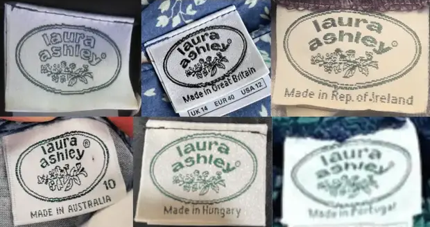

# Find My Laura Ashley

### Where it started...
I have been collecting Laura Ashley dresses for a few years, especially the vintage-inspired floral dresses from the brand's 'golden era' - the 1980s. Vintage prairie dress collectors and lovers like myself, are very fond of these dresses for their quality craftsmanship, 100% cotton fabric and floral patterns, as well as the nostalgic, pictorial and romantic style.

Finding a Laura Ashley dress that also fits perfectly is not easy. Since the brand stopped making these dresses after the 80s, and had gone out of business in 2020, these dresses are only available through second-hand sellers on platforms, like Etsy. The search is then further complicated by vintage sizing discrepancies: a 1980s Laura Ashley dress labelled as a 'UK 10' might fit a modern UK 8. Moreover, the brand's popularity leads some sellers to label other non-Laura-Ashley floral dresses as _'Laura Ashley style'_ or _'like Laura Ashley'_, adding another layer of complexity to the search.

This project aims to identify the perfect Laura Ashley dress, by fetching data from Etsy's website via API, and filtering the downloaded .json file results based on the listings' descriptions, such as size and measurements. After the filtering process, a pre-trained Random Forest Classifier model is used to detect if any images of the listings contain a tag showing the pre-2000s Laura Ashley logo. As a final step, an emailing script was designed to wrap up all the findings in a neat email, containing both predicted 'True' and 'False' results, to avoid missing out on a genuine dress.


1980s Vintage Laura Ashley Tags<br/>
<sup>image source: https://vintageclothingguides.com/tags-labels/how-to-tell-if-laura-ashley-is-vintage</sup><br/>
<sup>This blog also contains some in-depth information on Laura Ashley tags and styles over the years, it's worth a read if you're interested!</sup>


## 1. Fetching and Filtering Data from Etsy
The first step is to fetch, filter and save data from Etsy's active listings. The `get_data.py` script is designed to do exactly this. The script interacts with Etsy's Open API v3. To check if your API works, you could first run the API tester script to check if your API key is working:

```
python test_etsy_api.py
```

Endpoints used and documentation references:
- [findAllListingsActive](https://developers.etsy.com/documentation/reference/#operation/findAllListingsActive)
- [getListingProperties](https://developers.etsy.com/documentation/reference/#operation/getListingProperties
)
- [getListingImages](https://developers.etsy.com/documentation/reference/#operation/getListingImages)


### Instructions to Run
To fetch and save data:

```
python get_data.py
```

### Features
**Data Fetching:** Retrieves active listings from Etsy using specific keywords related to vintage Laura Ashley dresses.

**Data Filtering:** Implements two levels of filtering:

- Level 1 Filtering: Filters listings based on title keywords, and creation timestamp. This script is designed to run once a week, so I only aim to fetch the listings that were created and posted within the last week.
- Level 2 Filtering: Further filters the listings based on specific property values like whether it is a clothing, and its listed size.

**Saving Data and Directory Management:** Saves the filtered listings along with their properties and associated images as .json files, and automatically creates directories based on the current date in order to organise the saved data.

**Sample output:**
```
1. Initial Data Extraction:
- Total active listings retrieved: 820
- Data saved to etsy_data/raw/etsy_listings.json
2. First Level Filtering:
Listings after 1st level filtering: 43
- Data saved to etsy_data/raw/filtered_listings_properties.json
3. Second Level Filtering:
- Listings after 2nd level filtering: 3
- Data saved to etsy_data/240723/listings.json
All fetching and saving operations have been completed successfully.
```

## 2. Making Predictions
The `predict.py` script is designed to run a classification model on the saved data from the previous step, identifying if any images contain the 1980s Laura Ashley tag.

### Classification Model
Hoping to automate the identification of authentic Laura Ashley dresses from online listings as much as possible, I trained a Random Forest model focusing on recognising the iconic Laura Ashley logo, particularly the one from the 1980s. This task will be very helpful in the process, because many sellers tend to upload these close-up photos of the label, as they serve as a key indicator of authenticity.

To train the model, I gathered images to form a dataset comprising two categories:

| Label Images | Non-label Images |
|--------------|------------------|
| <sup>These images featured the distinctive Laura Ashley tags from the 80s. The images are mostly clear with the tag centred, making them idea for model training.</sup> | <sup>These include a variety of pictures of general product photography, not showing any Laura Ashley logos.</sup> |
|  |  |

I aimed to curate the dataset to closely mimic the type of images the model would encounter when deployed. Specifically, for the non-logo images, I selected examples that captured the typical noise and variability found in real-world data. These images showcase various elements such as the dress, intricate details, and different parts of the label, thereby providing a comprehensive representation of the non-logo context.

### Model Performance
You can find the notebook documenting the model training & hyperparameter tuning [here](https://github.com/xiaoella/find_my_laura_ashley/blob/main/notebooks/Model%20Training.ipynb).

The model demonstrates strong performance with an accuracy score of 89.23% and a recall score of 89.75%, highlighting its effectiveness in capturing actual positives to identify Laura Ashley logo tags. Despite the precision score is marginally lower at 88.37%, it aligns with my requirement of ensuring higher accuracy and recall while maintaining an acceptable level of false positives.

### Instructions to Run
```
python predict.py
```
Note: run the script after data has been fetched and saved.

This script will process all images in each listing folder using a Random Forest model. If the model detects a logo in any of the images for a given folder, it will classify that listing as 'True'. This indicates that it is likely to be a genuine Laura Ashley dress, as the presence of a logo in at least one image suggests authenticity.

At the end of the script, a .csv file is generated that summarises the results, preparing for sending the email (the next step).


## 3. Sending Results in an Email
The `send_email.py` script, as the final step, will compose and wrap up the results of this analysis in an email that contains the title description of the listing, the main (homepage) image of the listing, and a clickable link that takes me to the Etsy site. This script is executed after the data has been fetched and filtered, and predictions have been made.

Although the listings have been labelled as 'True' or 'False' in the previous step, the email will still include all listings that have passed the second level of filtering. It is possible that 'False' listings are still authentic Laura Ashley dresses, but the seller might not have uploaded a picture of the logo, or my model may have produced a false negative result. Therefore, I chose to include the 'False' results in a secondary section of the email, suggesting they might still be Laura Ashley dresses.

The script includes basic error handling to catch and print errors related to email sending or file operations. It is also prepared for different scenarios, such as when there are no listings (i.e. the dataframe is empty). If all listings are predicted as 'True', the email body will include details and images of these and will omit sections related to false predictions, and vice versa if only the 'False' ones are present.


### Instructions to Run
```
python send_email.py
```
Note: run the script after data has been fetched and saved, and predictions have been made.

**Sample Email**

|  |  |
|---------------------------------------------|---------------------------------------------|

Sample Email when there is only one section related to the predictions:


Sample Email when there are no listings after fetching and filtering:

