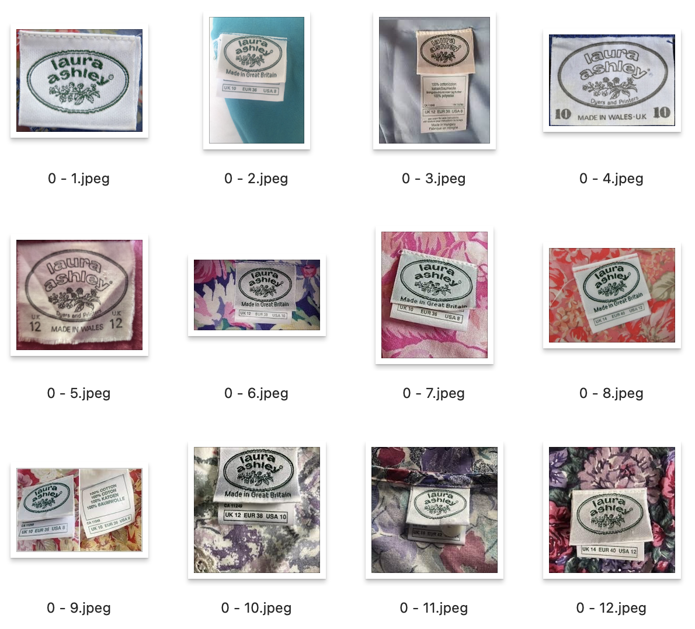
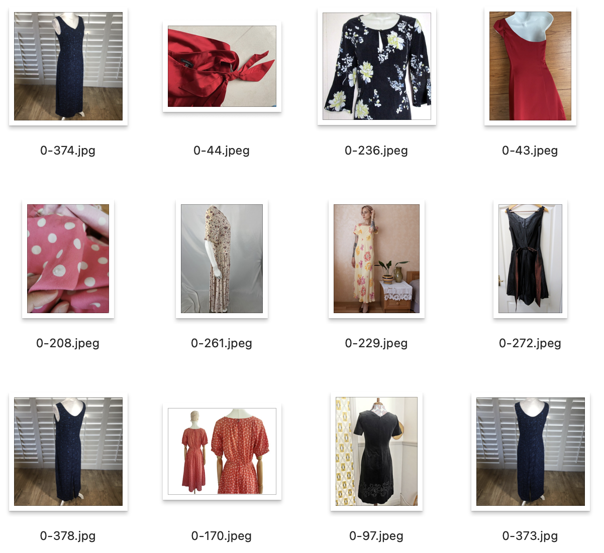
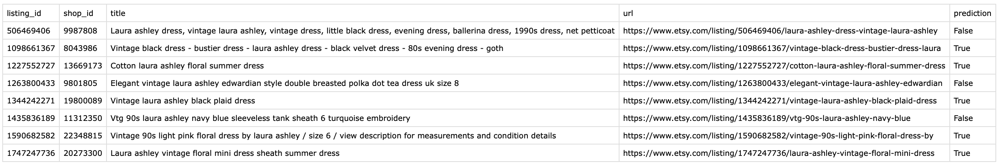
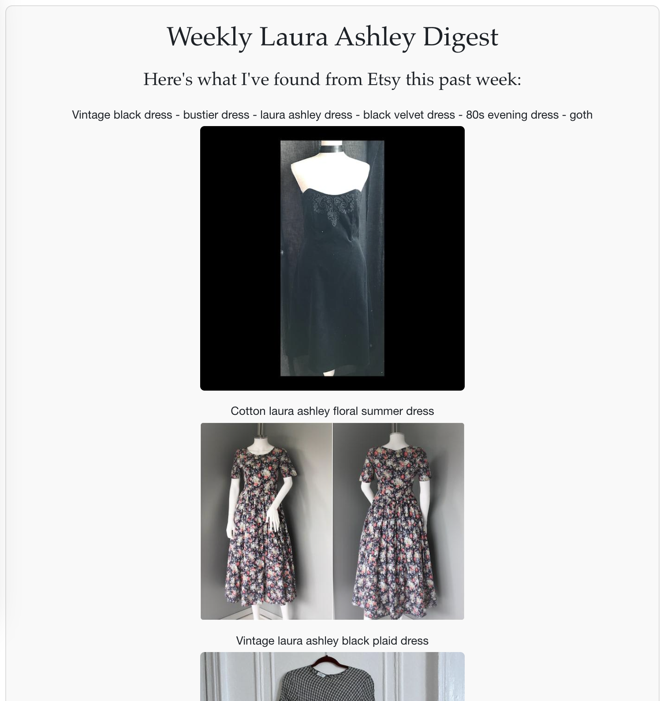
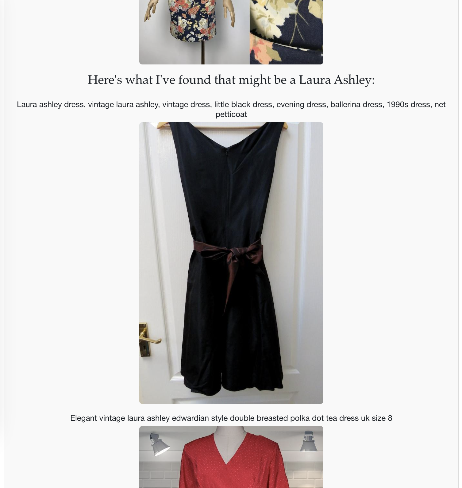
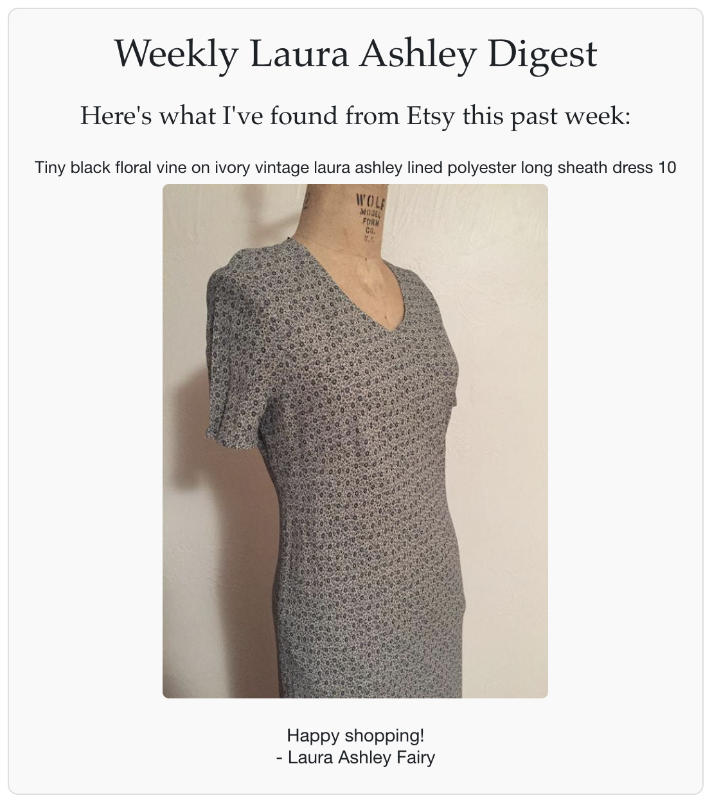
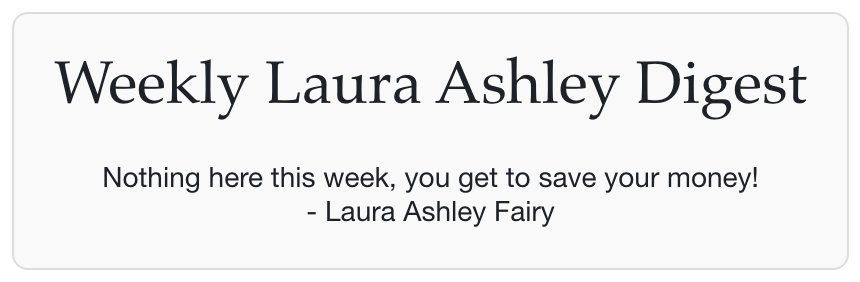

# Find My Laura Ashley

### Where it started...
I have been collecting Laura Ashley dresses for a few years, especially the vintage-inspired floral dresses from the brand's 'golden era' in the 1980s. Vintage fashion enthusiasts and collectors, like myself, are very fond of these dresses for their quality craftsmanship and their nostalgic, pictorial, and romantic style.

Finding a Laura Ashley dress that also fits perfectly is not easy. Since the brand stopped making these silhouettes and patterns after the 80s, and has gone out of business in 2020, these dresses are only available through second-hand sellers on platforms like Etsy. This search is further complicated by vintage sizing discrepancies: a 1980s Laura Ashley dress labelled as a 'UK 10' might fit a modern UK 8. Moreover, the brand's popularity leads some sellers to label non-Laura Ashley dresses as _'Laura Ashley style'_ or _'like Laura Ashley'_, adding another layer of complexity to the search.

This project aims to identify the perfect Laura Ashley dress by fetching data from Etsy's website via the Etsy API, and filtering the results based on the listings' descriptions including sizes and measurements. It also use a Random Forest Classifier model to try to recognise if any images of the listed item contains the Laura Ashley label showing its 1980s logo.

## 1. Fetching and Filtering Data from Etsy
The `get_data.py` script is designed to fetch, filter and save data from Etsy's API.

### Features
**Data Fetching:** Retrieves active listings from Etsy's API using specific keywords related to vintage Laura Ashley dresses.

**Data Filtering:** Implements two levels of filtering:

- Level 1 Filtering: Filters listings based on title keywords, and creation timestamp.
- Level 2 Filtering: Further filters listings based on specific property values like clothing size.

**Saving Data and Directory Management:** Saves the filtered listings along with their properties and associated images into JSON files, then automatically creates directories based on the current date to organise saved data and images.

### Instructions to Run

**To check if your API works, just run:**
```
python test_etsy_api.py
```
It will then display if your API key is working or not.

**To fetch and save data (running the `get_data.py` script):**
```
python get_data.py
```

**Sample output:**
```
1. Initial Data Extraction:
- Total active listings retrieved: 820
- Data saved to etsy_data/raw/etsy_listings.json
2. First Level Filtering:
Listings after 1st level filtering: 43
- Data saved to etsy_data/raw/filtered_listings_properties.json
3. Second Level Filtering:
- Listings after 2nd level filtering: 3
- Data saved to etsy_data/240723/listings.json
All fetching and saving operations have been completed successfully.
```

## 2. Making Predictions
The `predict.py` script is designed to run a model on the saved data from the previous step, identifying if any images contains the Laura Ashley logo.

### Classification Model
Hoping to automate the identification of authentic Laura Ashley dresses from online listings as much as possible, I trained a Random Forest model focusing on recognising the iconic Laura Ashley logo, particularly the one from the 1980s. This task will be very helpful in the process, because many sellers tend to upload these close-up photos of the label, as they serve as a key indicator of authenticity.

To train the model, I gathered a dataset comprising two categories:

- Label Images: These images featured the distinctive Laura Ashley logo from the 1980s. The logos are mostly clear and centred, making them ideal for model training.



- Non-Label Images: These included a variety of Laura Ashley and Laura Ashley 'style' dress photos from Etsy listings. The images in this category did not contain the Laura Ashley logo and represented general product photography, capturing the typical noise and variability found in real-world data.



I aimed to curate the dataset to closely mimic the type of images the model would encounter when deployed. Specifically, for the non-logo images, I selected examples that represent real listings. These images showcase various elements such as the dress, intricate details, and different parts of the label, thereby providing a comprehensive representation of the non-logo context.

### Instructions to Run
**Running the script to make predictions on data collected from previous step:**
```
python predict.py
```

This script processes all images in each listing folder that's associated with each listing, using a Random Forest model. If the model detects a logo in any of the images for a given folder, it will classify that listing as 'True'. This indicates that it is likely a genuine Laura Ashley dress, as the presence of a logo in at least one image suggests authenticity.

At the end of the script, a .csv file is generated, which is prepared for emailing (the next step). This file summarises the prediction results, as illustrated in the example image below:


## 3. Sending Results in an Email
The send_email.py script as a final step, will compose and send an email containing the results of the Etsy data analysis, including images of the listings. This script is executed after the data has been fetched and filtered, and predictions have been made.

The script includes basic error handling to catch and print errors related to email sending or file operations. It is also prepared for different scenarios: such as when there are no listings (the dataframe is empty), or only one of "True" or "False" predictions exist. If there are only truly predicted listings, the body will include details and images of these and will omit sections related to false predictions, and vice versa for only the "False" ones present.

**Running the email script**
```
python send_email.py
```
## Sample Email

When there is a comprehensive DataFrame that contains both "True" and "False" predictions, the email will have two sections. It starts with the listings that have a "True" prediction. The second section of the email includes the "False" predictions. It is possible that these listings are still authentic Laura Ashley dresses, but the seller might not have uploaded a picture of the logo.

|  |  |
|:---:|:---:|

Sample Email when there is only one section related to the predictions:


Sample Email when there are no listings after fetching and filtering:

